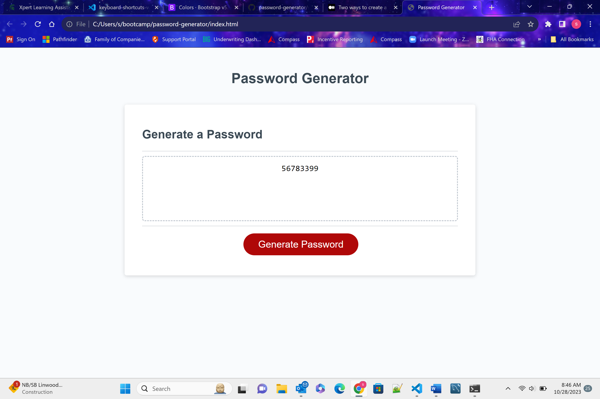

#  Password Generator

## User Story
As a student I want to create a password generator that displays my understanding of HTML, CSS, and Javascript at this stage in my program. 

## Acceptance Criteria
Goals include meeting the following criteria
-password must be between 8 and 128 characters
-must include prompts for lowercase, uppercase, special characters, and numbers
-must generate a password with the selected options from the users.
-project must show demonstrated knowledge of the following javascript areas
    -functions
    -arrays
    -event listener
    -display of messaging
    -use of prompts
    -using the console in google dev tools
    -debugging

### Sources
    <Daniel Vega> (<6/1/19>) <Random Password Generator in Javascript> (<Javascript>)[Youtube.com]

